# **Distribusi** {#distribusi}

```{r setup, include=FALSE}
# Set Working Directory
opts_knit$set(root.dir = normalizePath("./"))
```

## Data

```{r}
# Data
data_ev <- read.csv("Data/EV_Population.csv")
head(data_ev)
```

## Histogram {#histogram}

Histogram adalah grafik yang digunakan untuk menunjukkan distribusi data berdasarkan frekuensi kemunculannya dalam interval tertentu. Visualisasi ini menggunakan batang untuk mewakili jumlah atau frekuensi data yang berada dalam setiap interval atau bin. Histogram berguna untuk melihat pola distribusi data, apakah data cenderung terpusat di satu titik, tersebar merata, atau membentuk distribusi tertentu (misalnya normal atau skewed).

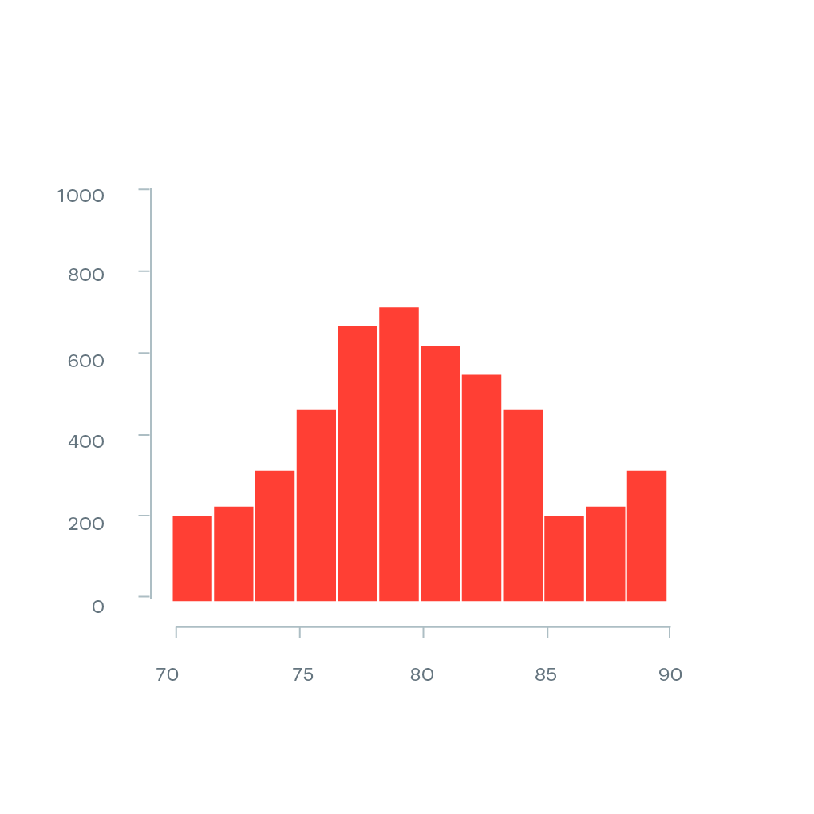{width="202"}

```{r fig.height=3.5, fig.width=10, dpi=300}
# Buat data simulasi
set.seed(123)  # Untuk reproduksibilitas
data_hist <- data.frame(
  Value = rnorm(1000, mean = 80, sd = 5)  # 1000 sampel dengan distribusi normal
)

# Buat Histogram
ggplot(data_hist, aes(x = Value)) +
  geom_histogram(binwidth = 2, fill = "red", color = "white") +  # Batang histogram
  labs(title = "Histogram Distribusi Data", x = "Nilai", y = "Frekuensi") +
  theme_minimal()

```

### Penjelasan Kode:

1.  `set.seed(123)`: Fungsi ini memastikan bahwa data yang dihasilkan dapat direproduksi pada setiap eksekusi kode.

2.  `rnorm(1000, mean = 80, sd = 5)`: Membuat 1000 sampel data yang terdistribusi normal dengan rata-rata 80 dan simpangan baku 5.

3.  `ggplot(data_hist, aes(x = Value))`: Membuat plot menggunakan paket `ggplot2`, dengan data yang diambil dari `data_hist` dan kolom `Value` sebagai sumbu x.

4.  `geom_histogram(binwidth = 2, fill = "red", color = "white")`: Menambahkan elemen histogram dengan lebar bin 2, warna batang merah, dan garis batas putih.

5.  `labs(title = "Histogram Distribusi Data", x = "Nilai", y = "Frekuensi")`: Memberikan judul pada grafik dan label pada sumbu x dan y.

6.  `theme_minimal()`: Mengatur tema plot menjadi minimal, menghilangkan elemen-elemen visual yang tidak perlu.

## Pyramid Chart {#pyramid-chart}

Pyramid Chart digunakan untuk membandingkan distribusi dua kategori yang saling berlawanan, misalnya populasi pria dan wanita. Grafik ini berguna untuk menunjukkan perbedaan ukuran atau proporsi dua kelompok dalam cara yang mudah dipahami.

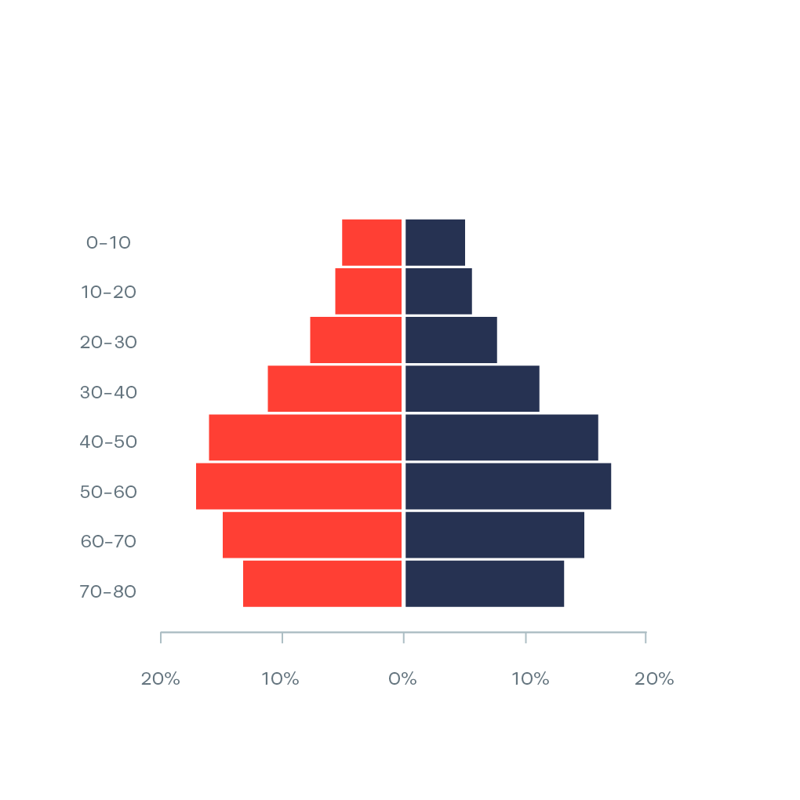{width="198"}

## **Visualizing Statistical Uncertainty with Charts** {#statistical-uncertainty}

Pada bagian ini, kita akan membahas beberapa metode untuk memvisualisasikan ketidakpastian dalam data menggunakan berbagai jenis grafik.

### Error Bars

Error bars digunakan untuk menunjukkan rentang ketidakpastian atau variasi dalam data. Mereka menggambarkan margin kesalahan, yang menunjukkan sejauh mana nilai dalam data dapat bervariasi.

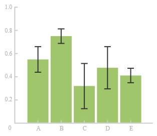{width="172"}

### Confidence Interval

Confidence Interval (CI) adalah rentang nilai yang kemungkinan besar mengandung nilai sebenarnya dari parameter yang diukur. CI biasanya digambarkan dalam bentuk garis atau area di sekitar nilai rata-rata.

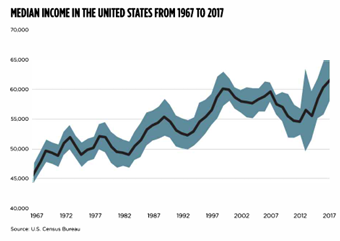{width="229"}

### Gradient Chart

Gradient Chart digunakan untuk menggambarkan perubahan bertahap dalam data, biasanya digunakan untuk menggambarkan data yang berkelanjutan dengan menggunakan gradasi warna untuk menunjukkan intensitas atau nilai.

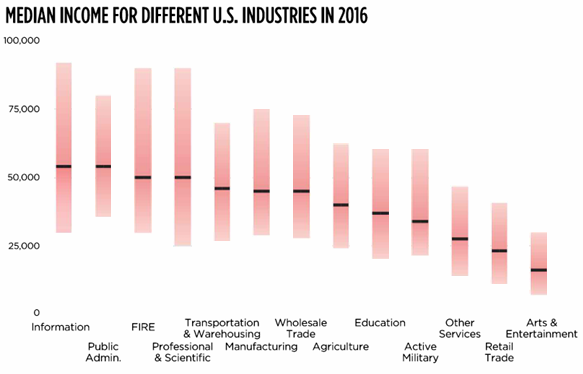{width="293"}

### Fan Charts

Fan Chart adalah jenis visualisasi yang digunakan untuk menunjukkan ketidakpastian dalam perkiraan masa depan. Rentang yang lebih lebar menunjukkan ketidakpastian yang lebih besar.

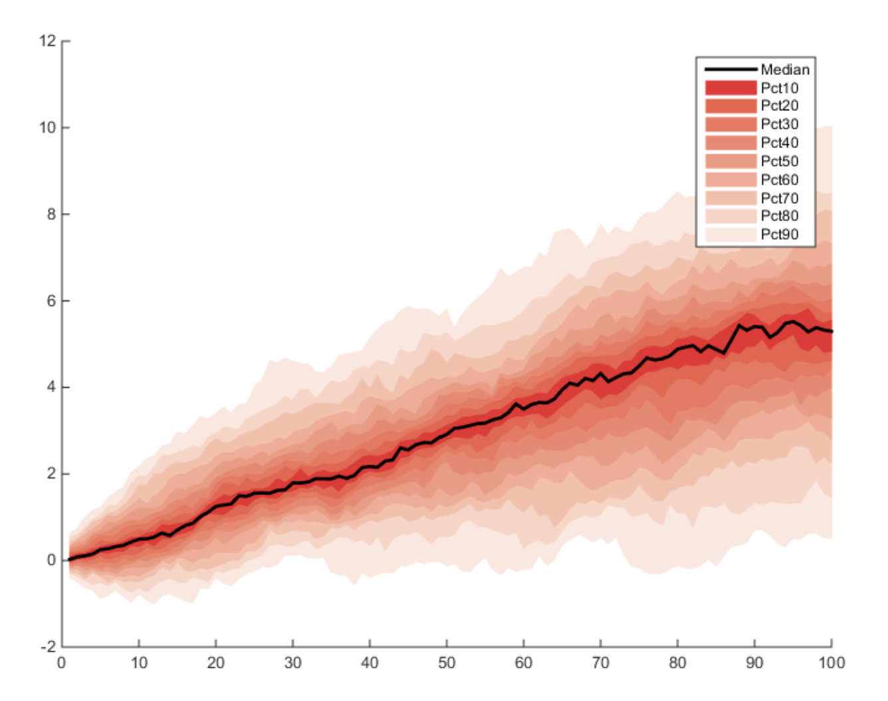{width="254" height="201"}

## Box-and-Whisker Plot {#boxplot}

Box-and-Whisker Plot (atau boxplot) adalah grafik yang digunakan untuk menggambarkan sebaran data melalui lima nilai statistik utama: minimum, kuartil pertama (Q1), median, kuartil ketiga (Q3), dan maksimum. Boxplot memudahkan untuk mengidentifikasi outlier dan melihat distribusi data.

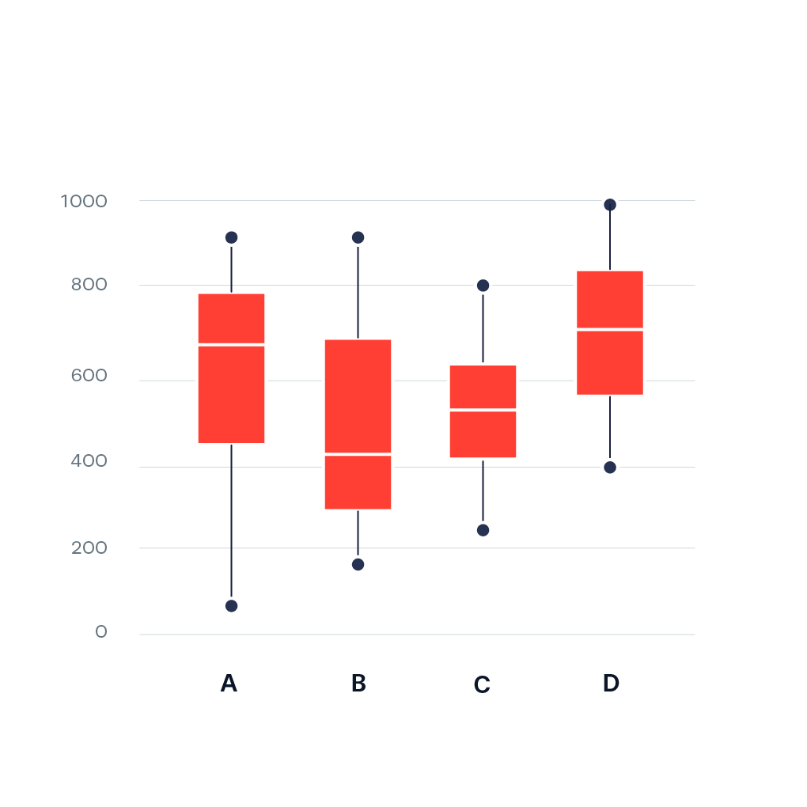{width="222"}

### Penjelasan Grafik Boxplot:

-   Kotak di tengah menunjukkan rentang antara Q1 dan Q3, dengan garis horizontal di dalam kotak menunjukkan nilai median.

-   Garis vertikal (whisker) di luar kotak menunjukkan nilai terendah dan tertinggi dalam data (selama masih dalam batas normal).

-   Titik di luar whisker menunjukkan outlier.

## Candlestick Chart {#candlestick-chart}

Candlestick Chart adalah grafik yang sering digunakan dalam analisis keuangan, terutama untuk menganalisis pergerakan harga saham. Setiap "lilin" pada grafik ini menunjukkan empat harga penting dalam suatu periode: harga pembukaan, harga penutupan, harga tertinggi, dan harga terendah.

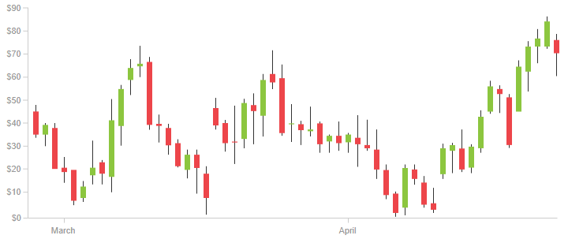{width="318"}

## Violin Chart {#violin-chart}

Violin Chart adalah kombinasi antara Boxplot dan Density Plot. Grafik ini memperlihatkan distribusi data dan memberikan gambaran yang lebih jelas mengenai kepadatan data pada berbagai nilai. Setiap sisi dari "biola" menunjukkan distribusi data secara simetris.

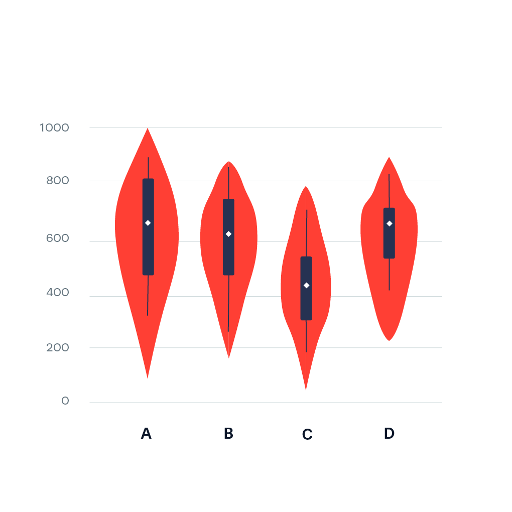{width="194" height="194"}

## Ridgeline Plot {#ridgeline-plot}

Ridgeline Plot digunakan untuk memvisualisasikan distribusi data yang tumpang tindih dalam satu grafik. Grafik ini berguna untuk menunjukkan bagaimana distribusi dari beberapa kelompok data saling berinteraksi atau berbeda.

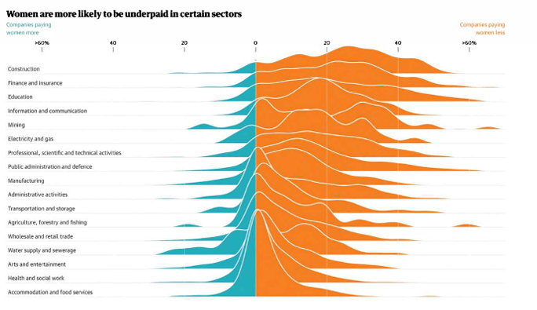{width="283"}

## **Showing the Data** {#uncertainty}

Bagian ini menjelaskan beberapa cara untuk menampilkan data dalam bentuk yang lebih terperinci.

### Strip Plot

Strip Plot adalah jenis visualisasi yang menampilkan data dalam bentuk titik-titik yang terpisah, memungkinkan kita untuk melihat distribusi dan pola data lebih detail, terutama untuk dataset yang lebih kecil.

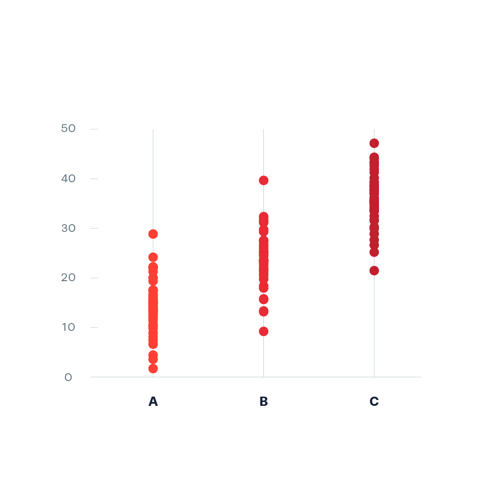{width="177"}

### Beeswarm Plot

Beeswarm Plot adalah variasi dari Strip Plot di mana titik-titik data akan "tergeser" untuk menghindari tumpang tindih, memberikan gambaran yang lebih jelas tentang kepadatan data.

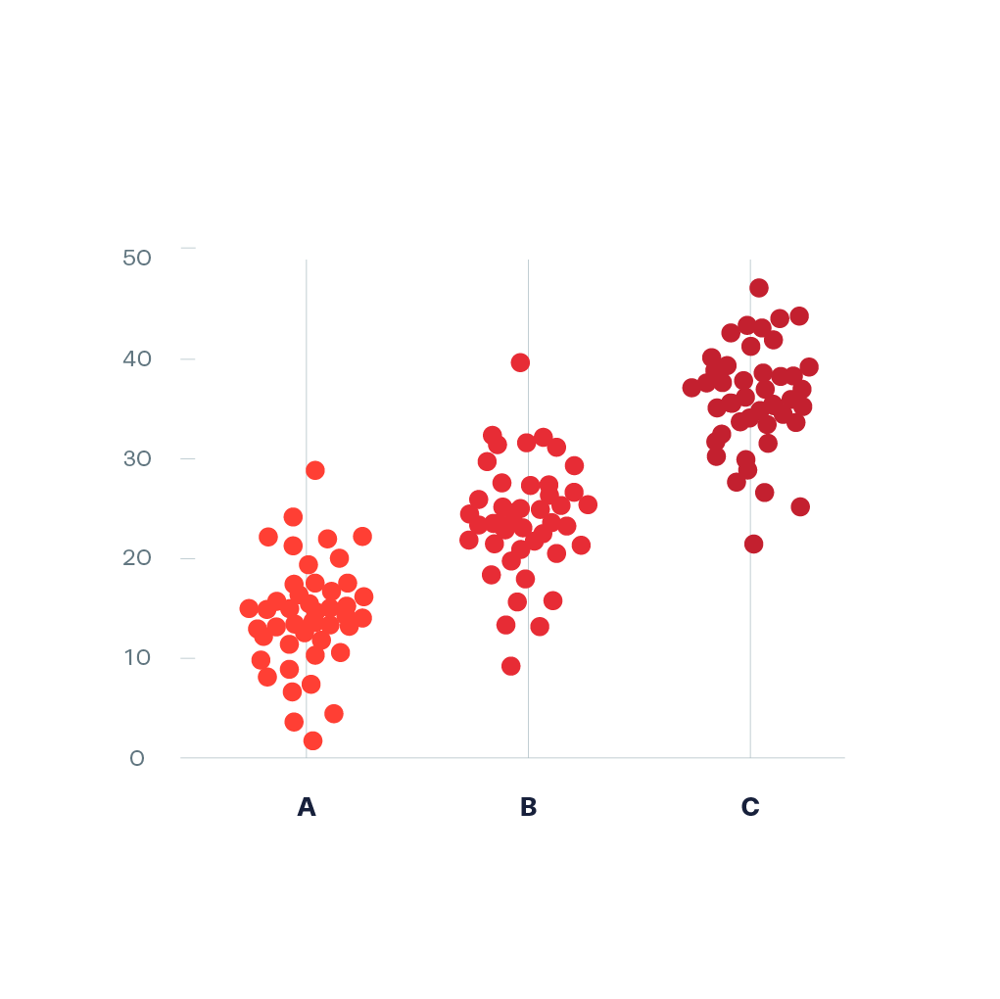{width="177"} 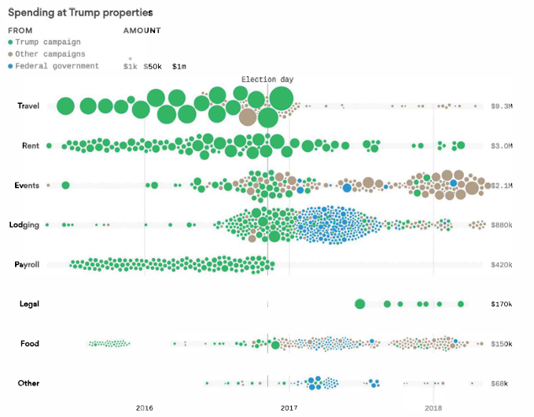{width="227"}

### Wilkinson Dot Plots and Wheat Plot

Dot Plots dan Wheat Plot adalah metode untuk memvisualisasikan data kategorikal dan numerik. Mereka menampilkan titik-titik atau simbol untuk setiap nilai dalam dataset, dengan fokus pada distribusi dan kesenjangan dalam data.

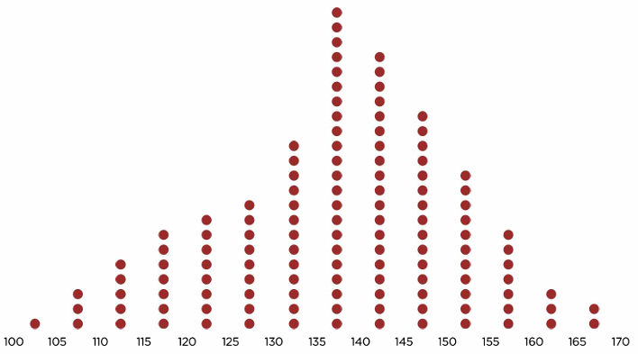{width="161" height="89"} 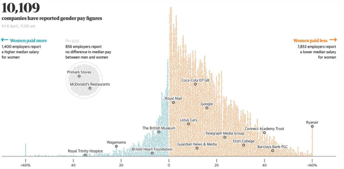{width="315"}

### Raincloud Plot

Raincloud Plot adalah gabungan antara Boxplot, Density Plot, dan Strip Plot yang memberi kita gambaran visual yang kaya tentang distribusi data, menggabungkan elemen-elemen tersebut untuk memberikan informasi lebih lengkap.

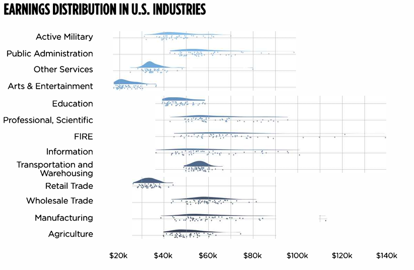{width="327"}

## Stem-and-Leaf Plot {#stem-leaf}

Stem-and-Leaf Plot adalah cara untuk menggambarkan distribusi data sambil mempertahankan nilai asli data. Ini adalah alternatif dari histogram yang menunjukkan distribusi data secara lebih tepat, dengan menggambarkan setiap nilai dalam dataset.

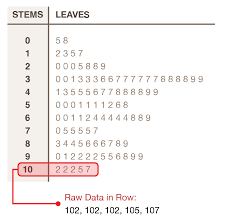

## Conclusion

Visualisasi distribusi data sangat penting untuk membantu kita memahami struktur dan pola dalam data. Setiap jenis grafik atau plot yang telah dibahas memiliki kegunaan dan kelebihan masing-masing, tergantung pada jenis data dan tujuan analisis yang dilakukan.
