# 📘 Modul Praktikum Visualisasi Data

**Mata Kuliah: STA1262 - Visualisasi Data**  
Repository ini berisi **modul praktikum** untuk mata kuliah **STA1262: Visualisasi Data**, yang membahas berbagai teknik visualisasi data menggunakan **R, Tableau, dan tools lainnya**.

---

## 🚀 **Cara Menggunakan Repository**

### 🔹 **1. Clone Repository**

Buka folder dimana kalian ingin menyimpan folder Modul-VisDat & Copy path nya.

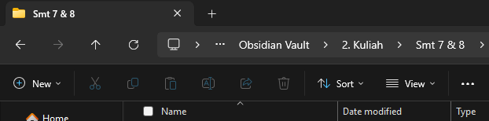

Buka VS-Code, lalu open folder

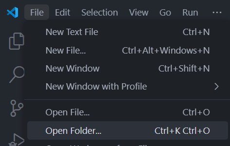

Paste path, select folder

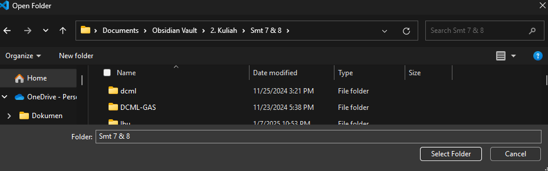

Open terminal dengan: `` Ctrl + Shift + `  ``

Buka Repo GitHub, copy kode berikut

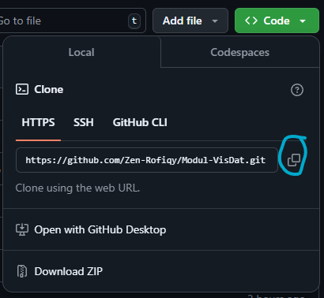

Clone dengan perintah:

```sh
git clone https://github.com/YOUR_GITHUB_USERNAME/Modul-VisDat.git
```

Lalu open folder lagi di VS-Code dan arahkan ke folder Modul-VisDat

### 🔹 **2. Rstudio Session**

Buka Rstudio, lalu New Project

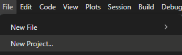

Pilih Existing Directory

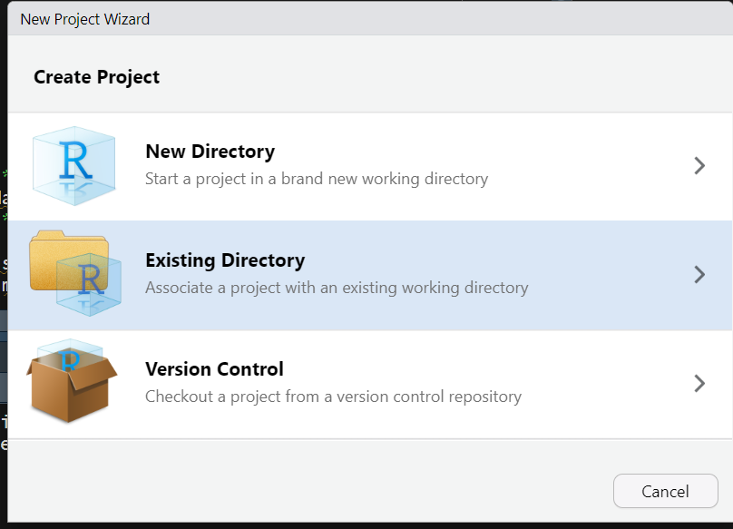

Browse, & pilih Folder Modul-VisDat, lalu Create Project.

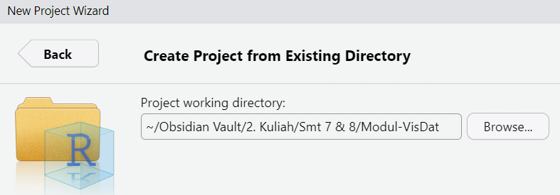

Selamat .Rproj sudah dibuat

### 🔹 **3. Change Branch**

> PENTING!!

Sebelum anda merubah apapun, pastikan anda mengubah branch anda terlebih dahulu! Ini agar mencegah konfilk di github branch main

Ke ujung kiri bawah VS-Code, klik ini

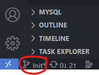

Bikin branch baru & kasih nama, misal `Dev-Nabil`

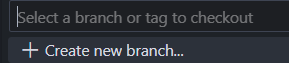

Pastikan namanya sudah berganti menjadi `Dev-Nabil`

### 🔹 **4. Install Quarto**

Pastikan **Quarto** sudah terinstal di sistem kamu. Jika belum, unduh dan instal dari [Quarto Official](https://quarto.org/).

Cek apakah Quarto sudah terinstal:

Di Rstudio, open terminal & paste command:

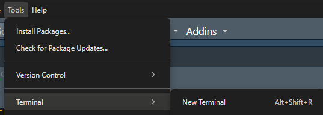

```sh
quarto --version
```

### 🔹 **5. Render Buku**

Setelah anda melakukan perubahan atau menambah file `.qmd` baru, untuk merender ulang buku Quarto, pada terminal jalankan:

```sh
quarto render
```

Atau gunakan short-cut `Ctrl + Shift + B`

Hasilnya akan disimpan di folder `docs/`. Jika ingin melihat hasilnya, tinggal double click file `index.html` pada folder `docs`.

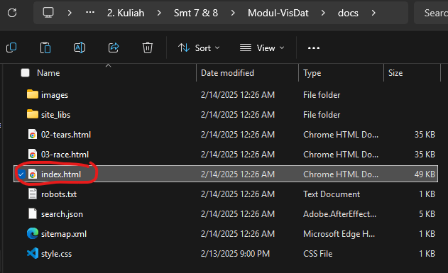

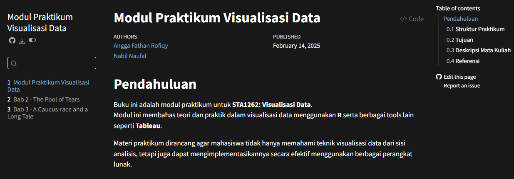

### 🔹 **6. Commit Change**

Klik ikon git di samping kiri VS-Code, lalu klik `+` paling atas jika anda ingin menmbahkan semua file dalam 1 Commit message. Atau anda bisa `+` satu per satu file mana saja yang anda ingin commit. Jangan lupa tambahkan commit message nya.

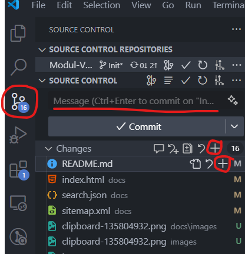

Lalu klik Sync Change untuk Push atau Publish Branch

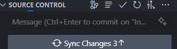

Jika semua tugas atau bagian anda selesai, selanjutnya anda Pull Request (untuk merge ke Main) dengan klik tanda ini:

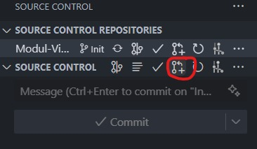

Pastikan Base nya adalah branch main. Tambah judul pull request dan deskripsi jika perlu. Lalu create.

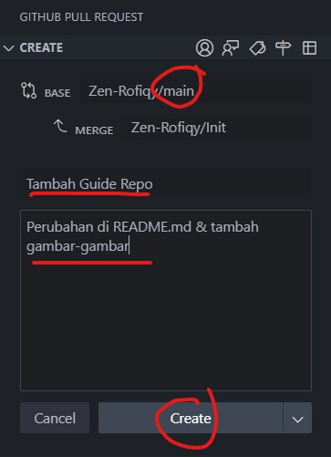

Jika perlu di review owner atau contributor lainnya, anda bisa comment. Jika sudah di acc oleh yang lain dan tidak ada konflik saat merge nya, klik Merge Pull Request & Create
Merge Commit.

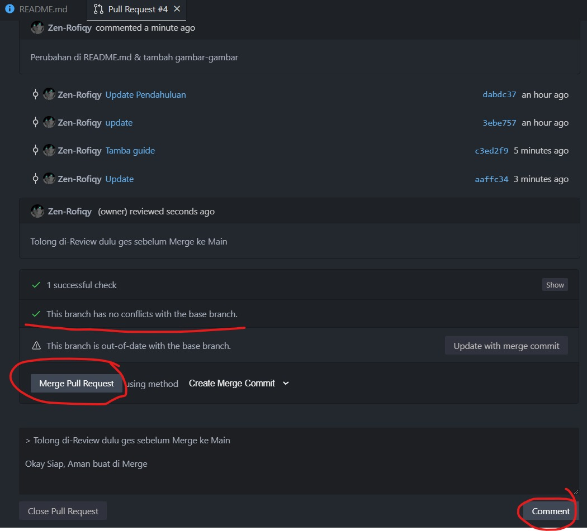

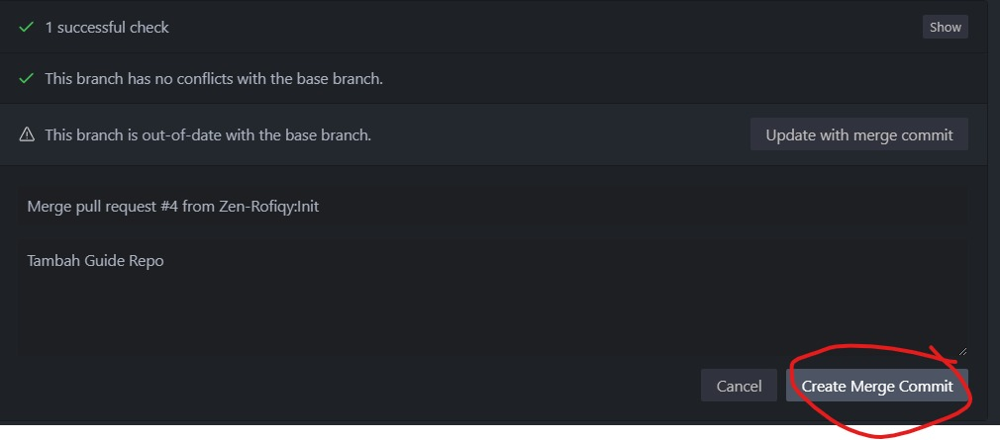

Cek repo GitHub, apakah sudah berhasil terbaharui atau blm.

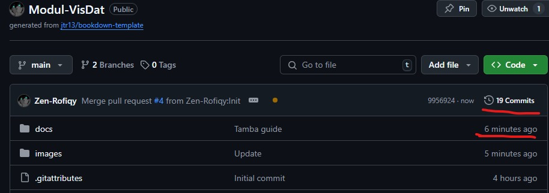

Selamat, anda sudah berhasil berkontribusi di Repository GitHub Modul-VisDat

---

## 🌐 **Akses Modul Secara Online**

Untuk cek modul di GitHub pages, link nya ada di samping kanan Repo GitHub nya. Atau bisa cek di deployments.

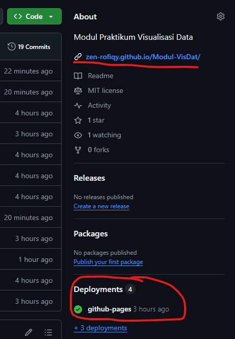

---

## 🛠 **Tentang Quarto**

Quarto adalah platform modern untuk pembuatan **buku, laporan, dan presentasi** berbasis Markdown.

### 📚 **Panduan Quarto**

🔗 [Quarto HTML Themes](https://quarto.org/docs/output-formats/html-themes.html)

### 🎨 **Galeri Quarto**

🔗 [Quarto Gallery](https://quarto.org/docs/gallery/)

---

## 📝 **Lisensi**

📜 [**MIT License**](LICENSE) – Modul ini dapat digunakan secara bebas sesuai dengan ketentuan lisensi.

---

🚀 **Dikembangkan oleh Tim Pengajar STA1262** | Statistika dan Sains Data | 2025
